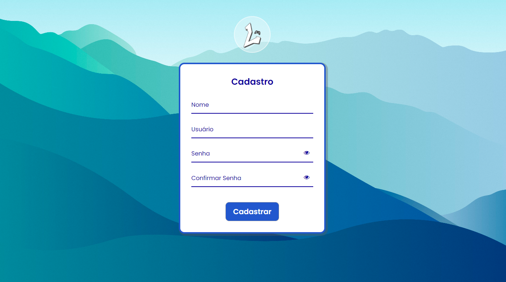
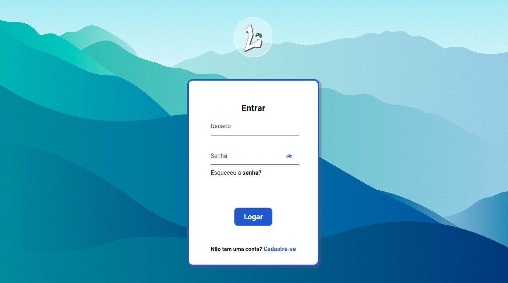

# Loja Gamer Lumatika

Projeto proposto pela faculdade, na matéria de Codigos de Alta-Performace para avaliar técnicas de desenvolvimento web com Html, css e JavaScript.

## 🚀 Começando

## 🛠️ Construído com

HTML, CSS, JAVASCRIPT

## 📌 Versão

Nós utilizamos [Git Flow](https://www.alura.com.br/artigos/git-flow-o-que-e-como-quando-utilizar) para controle de versão.

## ✒️ Autores

Equipe de desenvolvimento do projeto e suas respectivas  matrículas:

* **Thiago Mota - 01587816** - *Desenvolvedor* - [Github](https://github.com/euthiagomota)
* **Lucas Miguel - 01601160** - *Desenvolvedor* - [GitHub](https://github.com/1Lucas5)
* **Kayo Vinicius - 01590486** - *Desenvolvedor* - [GitHub](https://github.com/kaka2099)
* **Marcio Maycom - 01607574** - *Desenvolvedor* - [GitHub](https://github.com/mihaeldatoman)
